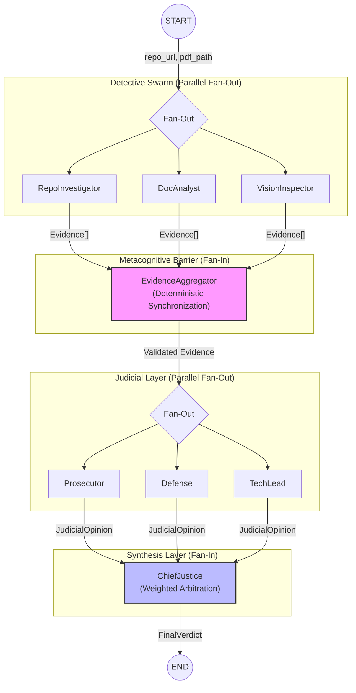

# Automaton Auditor: Interim Forensic Report

## 🎖️ Executive Summary
This report defines the architectural and tool-level implementation of the **Automaton Auditor**. The system utilizes a hierarchical multi-agent swarm designed to maintain deterministic integrity during the forensic analysis of software and documentation.

## 🏛️ StateGraph Architecture
The auditor operates via a structured directed graph (LangGraph), ensuring explicit synchronization between objective forensic extraction and subjective judicial reasoning.

### Graph Topology & State Flow

### Edge & State Definitions
- **Evidence**: Structured pydantic objects containing `goal`, `found`, `rationale`, and a constrained `confidence` score (0.0-1.0).
- **JudicialOpinion**: Persona-driven evaluation with strict `score` boundaries (1-5), `argument`, and `cited_evidence`.
- **FinalVerdict**: A synthesized `AuditReport` with consensus scores and a high-fidelity `remediation_plan`.

### Concurrency & Determinism
- **Execution Order Independence**: Because nodes are pure functions and the graph is acyclic, the final state is independent of the order in which parallel nodes finish their execution.
- **Deterministic Aggregation**: Utilizing `operator.add` (lists) and `operator.ior` (dicts) as reducers ensures that evidence and opinions are combined commutatively; the aggregator's final array is always a complete, order-invariant union of all branch outputs.
- **No Shared Mutable State**: Each agent operates on a local snapshot of the `AgentState`. Communication occurs strictly via returning updates to the global state, eliminating race conditions and side effects during parallel fan-out.

---

## ⚖️ Judicial Layer & Synthesis Plan

### Persona Differentiation Strategy
To prevent "persona drift" and ensure a robust adversarial debate:
- **Prosecutor**: Focused on strict adherence to best practices; biased toward identifying failures and technical debt.
- **Defense**: Evaluates mitigating factors (e.g., prototype stage, specific constraints); biased toward project viability.
- **Tech Lead**: Constrained by pragmatism and "Level 2" implementation feasibility; acts as a deterministic pivot.

### Deterministic Synthesis Rules (ChiefJustice)
- **Weighted Scoring**: Tech Lead weights (40%), Prosecutor/Defense (30% each).
- **Variance Threshold**: If score variance between any two judges exceeds **2 points**, an automatic `dissent_summary` is triggered for human review.
- **Remediation Extraction**: The ChiefJustice merges `cited_evidence` from all judges to generate a non-redundant, actionable remediation plan.

---

## 🛠️ Architectural Trade-off Analysis

| Decision | Why | Alternative | Trade-off |
| :--- | :--- | :--- | :--- |
| **AST over Regex** | Regex fails on multiline/nested logic; AST provides reliable structural truth. | Regex Parsing | AST has higher compute overhead but prevents false negatives. |
| **Pydantic State** | Prevents shared dict corruption and ensures rigid schema enforcement. | Raw Python Dicts | More boilerplate but provides "Fail Fast" validation on agent outputs. |
| **Sandbox Clone** | Prevents arbitrary code execution and maintains forensic isolation. | Direct Local Clone | Slight disk/network overhead for each run but ensures statelessness. |
| **RAG-lite (Keyword)** | High reliability for technical citations; avoids embedding hallucination. | Vector/Embedding DB | Less semantic depth but 100% deterministic citation retrieval. |

---

## 🔍 Forensic Capabilities

### 1. Repository Investigation (`RepoInvestigator`)
- **Deep AST Analysis**: Parses Python source code to verify the presence of `StateGraph` instances and correct node configurations.
- **Git Forensics**: Analyzes commit history to distinguish between "Iterative Development" and "Monolithic Dumps."
- **Sandboxed Execution**: Clones repositories into temporary directories to maintain forensic isolation.
- **Tool Safety Scanner**: Uses AST inspection to detect unsafe Python calls (e.g., `os.system`, `eval`, `exec`) in the target codebase.

### 2. Document Analysis (`DocAnalyst`)
- **RAG-lite Retrieval**: Implements keyword-based search over PDF chunks with citation preservation (page-level granularity).
- **Confidence Scoring**: Dynamically adjusts evidence confidence based on keyword density and proximity.

### 3. Vision Inspection (`VisionInspector`)
- **Multimodal Extraction**: Automatically extracts image assets from technical reports for visual verification of architectural claims.

---

## 🛡️ Evidenced Robustness & Tool Engineering

To ensure "Master Thinker" tier reliability, the auditor implements rigorous safety protocols beyond basic script execution.

### 1. Forensics-Grade Sandboxing
- **Technique**: All repository cloning utilizes `tempfile.TemporaryDirectory` followed by `subprocess.run` with checked return codes.
- **Why**: This prevents arbitrary code execution within the host environment and ensures each audit run starts from a clean, stateless baseline. **Raw `os.system()` calls are strictly forbidden.**

### 2. AST-Based Structural Veracity (Non-Regex)
- **Implementation**: The `RepoTools` module utilizes Python's `ast` library to traverse the tree and identify structural properties (e.g., searching for `StateGraph` object instantiations and `add_conditional_edges` method calls).
- **Advantage**: Unlike regex-based scrapers, AST inspection is immune to formatting changes, nested definitions, and multiline logic, providing high-fidelity architectural ground truth.

### 3. Fail-Safe Orchestration (Conditional Routing)
- **Skip Logic**: The `start_router` dynamically samples available artifacts. If `repo_url` or `pdf_path` is missing, the graph gracefully bypasses the corresponding detectives instead of crashing.
- **Failure Node**: A terminal `failure_node` is reached if zero artifacts are found, providing a descriptive audit abort reason rather than a generic stack trace.

### 4. Failure Mode Verification
The system has been validated against common failure scenarios via automated unit tests:
- **Unsafe Code Detection**: Successfully detects and flags `os.system` or `eval` usage in target repositories.
- **Graceful PDF Ingestion**: Handles missing or corrupted documents without system crash, returning a factual `found: False` evidence object.
- **Invalid Repo Handling**: Correctly catches `subprocess` errors for invalid Git URLs and classifies them as forensic mismatches.

## 🏗️ Reproducibility & Professional Infrastructure

The repository is built for seamless reproduction and technical audit.

### 1. Dependency Management
- **Toolchain**: Built with `uv` for deterministic, cross-platform dependency resolution.
- **Locking**: Includes a `uv.lock` file ensuring every auditor runs on the exact same forensic environment (Python 3.14+).

### 2. Environment Safety
- **Granular .env.example**: Every environment variable is explicitly documented with its purpose and expected format.
- **Zero Pollution**: No secrets are committed, and bytecode/system files are strictly excluded via `.gitignore`.

### 3. Command Line Interface (CLI)
- **Flexibility**: The system provides a clean CLI in `main.py` allowing auditors to specify arbitrary target repositories using the `--repo` and `--pdf` flags, moving away from hardcoded configurations.

---
*Status: Architecture & Forensic Tools Finalized *
