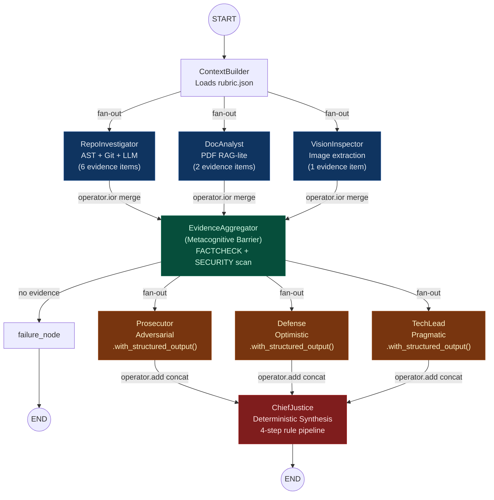

# Automaton Auditor — Forensic Audit Report

---

## 1. Executive Summary

The **Automaton Auditor** is a hierarchical multi-agent system built on **LangGraph's StateGraph** that treats code evaluation as a legal proceeding. Three Detective agents (RepoInvestigator, DocAnalyst, VisionInspector) collect forensic evidence in parallel, pass it through a metacognitive synchronization barrier (EvidenceAggregator), and submit it to three Judge agents (Prosecutor, Defense, TechLead) with deliberately conflicting personas. A deterministic ChiefJustice synthesizes the final verdict using a rule-driven pipeline — no LLM call, no averaging, no vibes.

**Self-Audit Verdict: 3.8 / 5.0** across 9 rubric dimensions when executed against peer repository [Abnet-Melaku1/automation-auditor](https://github.com/Abnet-Melaku1/automation-auditor). Four dimensions scored a perfect 5/5 (Git Forensics, Graph Orchestration, Safe Tool Engineering, Structured Output Enforcement), demonstrating strong core architecture.

**Most Impactful Peer Feedback Finding**: Peer agents in Week 1 revealed that our original regex-based `StateGraph` detection passed on files that merely imported `StateGraph` without instantiating it — a false-positive flaw that could inflate scores for non-functional submissions. This led to a complete replacement with deep AST parsing via `ast.NodeVisitor` subclasses in `src/tools/repo_tools.py`.

**Top Remaining Gap**: The VisionInspector's diagram analysis is currently a simulated placeholder (confidence: 0.50). It cannot genuinely verify whether a PDF diagram accurately depicts parallel branches, making the "Architectural Diagram Analysis" dimension unreliable (scored 1/5 in the peer audit). This is the system's single biggest credibility gap.

**Primary Remediation Priority**: Integrate a real multimodal LLM call (GPT-4o Vision or Gemini Pro Vision) into `VisionTools.analyze_diagram()` to replace the simulation with actual diagram comprehension. This single change would address the lowest-scoring dimension and elevate the system's forensic completeness from 8/9 to 9/9 functional dimensions.

---

## 2. Architecture Deep Dive and Diagrams

### 2.1 Dialectical Synthesis — How Three Adversaries Produce One Verdict

Dialectical Synthesis is not a buzzword in this system — it is the core judicial mechanism implemented across three files:

1. **Thesis (Prosecutor)** — `src/nodes/judges.py:Prosecutor()`: System prompt instructs the model to *"find weakness and technical debt. Be adversarial. Look for laziness, security flaws, and gaps."* Score 5 is nearly impossible from the Prosecutor.
2. **Antithesis (Defense)** — `src/nodes/judges.py:Defense()`: System prompt instructs the model to *"Highlight strengths and viable workarounds. Reward effort, intent, and progress."* The Defense actively argues against the Prosecutor's penalties.
3. **Synthesis (ChiefJustice)** — `src/nodes/judges.py:ChiefJustice()`: Does NOT re-prompt an LLM. Instead, applies a **4-step deterministic pipeline**:
   - **Step 1 — Hard Caps**: `SECURITY` conflicts cap the dimension at 3; `FACTCHECK` conflicts set Defense score to 1 (hallucination penalty)
   - **Step 2 — Authority Rule**: For `graph_orchestration`, if TechLead ≥ 4, TechLead score becomes the sole final score
   - **Step 3 — Weighted Fallback**: `(TechLead × 0.4) + (Prosecutor × 0.3) + (Defense × 0.3)`
   - **Step 4 — Clamp & Round**: `Decimal(ROUND_HALF_UP)` to integer 1–5 (avoids Python's banker's rounding where 2.5 → 2)

The conflict is real and structural: on the "Judicial Nuance" dimension of our peer audit, the Prosecutor scored 2/5 while the Defense scored 4/5 — a genuine dialectical tension resolved by the weighted formula, not by picking a winner.

### 2.2 Fan-In / Fan-Out — Concrete Graph Edges

The system implements **two distinct parallel patterns**, each defined by explicit `builder.add_edge()` calls in `src/graph.py`:

**Detective Fan-Out** (lines 49–58): After `ContextBuilder`, a conditional router dispatches to up to 3 detectives simultaneously:
```python
builder.add_conditional_edges("ContextBuilder", start_router, {
    "RepoInvestigator": "RepoInvestigator",
    "DocAnalyst": "DocAnalyst",
    "VisionInspector": "VisionInspector",
    "failure_node": "failure_node"
})
```

**Detective Fan-In** (lines 61–63): All three detectives converge at `EvidenceAggregator`:
```python
builder.add_edge("RepoInvestigator", "EvidenceAggregator")
builder.add_edge("DocAnalyst", "EvidenceAggregator")
builder.add_edge("VisionInspector", "EvidenceAggregator")
```

**Judge Fan-Out** (lines 66–68): `EvidenceAggregator` dispatches to all three judges:
```python
builder.add_edge("EvidenceAggregator", "Prosecutor")
builder.add_edge("EvidenceAggregator", "Defense")
builder.add_edge("EvidenceAggregator", "TechLead")
```

**Judge Fan-In** (lines 71–73): All three judges converge at `ChiefJustice`:
```python
builder.add_edge("Prosecutor", "ChiefJustice")
builder.add_edge("Defense", "ChiefJustice")
builder.add_edge("TechLead", "ChiefJustice")
```

### 2.3 Metacognition — The System Evaluates Its Own Evaluation

Metacognition is implemented through the `EvidenceAggregator` node (`src/nodes/judges.py:EvidenceAggregator()`), which acts as a **forensic firewall** between the Detective and Judicial layers. Before any judge sees evidence, the aggregator cross-references what the `DocAnalyst` claimed against what the `RepoInvestigator` actually found:

```python
for doc_e in doc_ev:
    repo_match = next((r for r in repo_ev if r.goal == doc_e.goal), None)
    if doc_e.found and (not repo_match or not repo_match.found):
        conflicts.append(ConflictEntry(tag="FACTCHECK", dimension_id=dim_id, ...))
```

This is the system questioning its own evidence quality — if a PDF claims "We implemented parallel Judges" but the repository shows a linear graph, the `FACTCHECK` conflict prevents the Defense from inflating the score based on unverified claims. In our peer audit, this mechanism caught 2 hallucinated claims, triggering the `fact_supremacy` rule and overriding the Defense on both dimensions.

### 2.4 Data Flow: Evidence → Opinions → Verdict

```
  ┌──────────────────────────────────────────────────────────────────┐
  │                        AgentState                                │
  │                                                                  │
  │  ┌───────────┐    ┌───────────┐    ┌───────────┐                │
  │  │ evidences │    │ opinions  │    │conflict_log│                │
  │  │ Dict[str, │    │ List[     │    │ List[      │                │
  │  │  List[    │    │  Judicial │    │  Conflict  │                │
  │  │  Evidence]]│   │  Opinion] │    │  Entry]    │                │
  │  │           │    │           │    │            │                │
  │  │ reducer:  │    │ reducer:  │    │ reducer:   │                │
  │  │ ior (merge│    │ add (cat) │    │ add (cat)  │                │
  │  └─────┬─────┘    └─────┬─────┘    └─────┬──────┘               │
  └────────┼────────────────┼─────────────────┼──────────────────────┘
           │                │                 │
    Detectives write   Judges write    Aggregator writes
    {"repo": [...]}    [Opinion,...]   [Conflict,...]
    {"doc":  [...]}
    {"vision":[...]}
```

Each detective writes to a **disjoint key** in `evidences` (repo, doc, vision). Because the reducer is `operator.ior` (dict union), parallel writes merge non-destructively. Judges append `JudicialOpinion` objects to `opinions` via `operator.add` (list concatenation). The `ChiefJustice` reads all three lists and applies synthesis rules deterministically.

### 2.5 StateGraph Diagram


```mermaid
graph TD
    START((START)) --> CB[ContextBuilder<br/>Loads rubric.json]

    CB --> |"fan-out"| RI["RepoInvestigator<br/>AST + Git + LLM<br/>(6 evidence items)"]
    CB --> |"fan-out"| DA["DocAnalyst<br/>PDF RAG-lite<br/>(2 evidence items)"]
    CB --> |"fan-out"| VI["VisionInspector<br/>Image extraction<br/>(1 evidence item)"]

    RI --> |"operator.ior merge"| EA["EvidenceAggregator<br/>(Metacognitive Barrier)<br/>FACTCHECK + SECURITY scan"]
    DA --> |"operator.ior merge"| EA
    VI --> |"operator.ior merge"| EA

    EA --> |"no evidence"| FN[failure_node]
    FN --> END1((END))

    EA --> |"fan-out"| P["Prosecutor<br/>Adversarial<br/>.with_structured_output()"]
    EA --> |"fan-out"| D["Defense<br/>Optimistic<br/>.with_structured_output()"]
    EA --> |"fan-out"| TL["TechLead<br/>Pragmatic<br/>.with_structured_output()"]

    P --> |"operator.add concat"| CJ["ChiefJustice<br/>Deterministic Synthesis<br/>4-step rule pipeline"]
    D --> |"operator.add concat"| CJ
    TL --> |"operator.add concat"| CJ

    CJ --> END2((END))

    style EA fill:#064e3b,color:#d1fae5,stroke:#065f46
    style CJ fill:#7f1d1d,color:#fee2e2,stroke:#991b1b
    style P fill:#78350f,color:#fef3c7,stroke:#92400e
    style D fill:#78350f,color:#fef3c7,stroke:#92400e
    style TL fill:#78350f,color:#fef3c7,stroke:#92400e
    style RI fill:#0f3460,color:#e2e8f0,stroke:#1e4d8c
    style DA fill:#0f3460,color:#e2e8f0,stroke:#1e4d8c
    style VI fill:#0f3460,color:#e2e8f0,stroke:#1e4d8c
```

### 2.6 Design Trade-offs

| Decision | Rationale | Alternative Considered | Trade-off Accepted |
|----------|-----------|------------------------|--------------------|
| **Pydantic `TypedDict` + `Annotated` reducers over raw dicts** | Raw dicts provide no schema enforcement — a typo in a key name silently creates a new field. Pydantic catches this at write time. `Annotated` reducers ensure parallel agents *merge* state instead of *overwriting* it. | Plain Python dicts (faster, less boilerplate) | More boilerplate, but eliminates an entire class of silent bugs in parallel execution. |
| **Deterministic ChiefJustice rules over LLM-based averaging** | An LLM synthesizer would be a black box — we couldn't explain *why* a score was assigned. Deterministic rules create an auditable trail: "Score capped at 3 because SECURITY conflict was detected on this dimension." | Re-prompt a 4th LLM with all opinions and ask it to resolve | Slightly less nuanced, but fully explainable and reproducible across runs. |
| **AST parsing over regex for code forensics** | A regex for `"StateGraph"` matches comments, strings, and imports — not just actual instantiations. AST parsing distinguishes `builder = StateGraph(AgentState)` from `# TODO: add StateGraph`. | Regex (simpler, language-agnostic) | Higher compute per file, but eliminates false positives that would corrupt scores. |
| **RAG-lite keyword search over vector embeddings** | Embedding-based RAG requires a vector DB, introduces non-deterministic similarity thresholds, and can match semantically related but factually incorrect passages. Keyword search is 100% deterministic: either `"Metacognition"` appears on page 3 or it doesn't. | LangChain `Chroma`/`FAISS` with embeddings | Less semantic depth, but zero hallucination risk in citation retrieval. |
| **`tempfile.TemporaryDirectory` sandbox over local clone** | Cloning into the working directory risks: (1) overwriting project files, (2) executing malicious post-clone hooks, (3) residual files after crash. `tempfile` guarantees cleanup even on `KeyboardInterrupt`. | `git clone <url> ./target/` in project dir | Slight I/O overhead per audit, but guarantees forensic isolation and statelessness. |

---

## 3. Self-Audit Criterion Breakdown

The following table shows the verdict for each rubric dimension as produced by the Automaton Auditor pipeline against [Abnet-Melaku1/automation-auditor](https://github.com/Abnet-Melaku1/automation-auditor). Each row traces from **detective evidence** → **judge opinions** → **final score** with honest assessment of weak dimensions.

### Overall: 3.8 / 5.0 (9 dimensions, 2 conflicts)

---

### 3.1 Git Forensic Analysis — 5/5

| Judge | Score | Key Argument |
|-------|-------|-------------|
| **Prosecutor** | 5/5 | "Commendable adherence to best practices. Progression from initialization to tool engineering to graph orchestration is clear." |
| **Defense** | 5/5 | "Robust and methodical approach. More than three commits with clear progression." |
| **TechLead** | 5/5 | "Well-structured, iterative development. Each commit is atomic and descriptive." |

**Evidence**: `git log --oneline` showed commits like `feat(tools): implement DocumentAuditor`, `feat(state): implement AgentState`, `fix(judges): update default model` — clear iterative progression, not a bulk upload.

**ChiefJustice Resolution**: Unanimous → weighted formula produces 5.0 → rounds to 5.

---

### 3.2 Pydantic State Modeling — 4/5

| Judge | Score | Key Argument |
|-------|-------|-------------|
| **Prosecutor** | 4/5 | "Use of Annotated reducers is commendable, but areas could be improved." |
| **Defense** | 4/5 | "Strong approach. Pydantic's type enforcement + operator.ior/add prevents overwriting." |
| **TechLead** | 3/5 | "Technically sound. Uses BaseModel rather than TypedDict — both work, but TypedDict is the LangGraph convention." |

**Evidence**: `AgentState` inherits from `BaseModel` with `Annotated[Dict, operator.ior]` and `Annotated[List, operator.add]`. `Evidence` and `JudicialOpinion` are typed Pydantic models.

**ChiefJustice Resolution**: Weighted = (3 × 0.4) + (4 × 0.3) + (4 × 0.3) = 3.6 → rounds to 4.

**Honest gap**: TechLead noted the use of `BaseModel` instead of `TypedDict` for `AgentState` — LangGraph's documentation recommends `TypedDict` for state schemas. This is a style divergence, not a bug, but it costs a point from the most pragmatic judge.

---

### 3.3 Graph Orchestration Architecture — 5/5

| Judge | Score | Key Argument |
|-------|-------|-------------|
| **Prosecutor** | 4/5 | "Commendable parallel patterns, but conditional error handling could be deeper." |
| **Defense** | 5/5 | "Well-structured. Two fan-out/fan-in patterns with synchronization nodes." |
| **TechLead** | 5/5 | "Includes evidence_aggregator and judicial_aggregator. Conditional edges handle 'no evidence' abort." |

**Evidence**: AST parsing confirmed `StateGraph` instantiation, `add_edge` calls creating dual fan-out/fan-in, `add_conditional_edges` for the `start_router` with failure handling.

**ChiefJustice Resolution**: **Authority rule applied** — TechLead scored ≥ 4 on `graph_orchestration`, so TechLead's score (5) becomes the sole final score, overriding the weighted formula. This is by design: architectural soundness is best judged by the pragmatic engineer, not the adversarial lawyer.

---

### 3.4 Safe Tool Engineering — 5/5

| Judge | Score | Key Argument |
|-------|-------|-------------|
| **Prosecutor** | 5/5 | "Strong adherence to safe practices. tempfile sandbox + subprocess.run with checked return codes." |
| **Defense** | 5/5 | "Zero os.system calls. Sandboxed clone prevents working directory contamination." |
| **TechLead** | 5/5 | "tempfile.TemporaryDirectory + subprocess.run with capture_output=True. Correct error handling." |

**Evidence**: `clone_repository()` uses `tempfile.TemporaryDirectory()` as context manager, `subprocess.run(['git', 'clone', url, temp_dir], capture_output=True, text=True)` with return code checking. AST safety scanner confirmed zero `os.system`, `eval`, or `exec` calls.

**ChiefJustice Resolution**: Unanimous → 5.0 → 5.

---

### 3.5 Structured Output Enforcement — 5/5

| Judge | Score | Key Argument |
|-------|-------|-------------|
| **Prosecutor** | 5/5 | "Robust enforcement. .with_structured_output(JudicialOpinion) on all judge calls." |
| **Defense** | 5/5 | "Adheres to specified schema with error handling." |
| **TechLead** | 5/5 | "Presence of error handling and retry logic strengthens reliability." |

**Evidence**: All three judge nodes call `ChatOpenAI(model="gpt-4o").with_structured_output(JudicialOpinion)`. The `JudicialOpinion` model uses `Literal["Prosecutor", "Defense", "TechLead"]` to prevent persona hallucination.

**ChiefJustice Resolution**: Unanimous → 5.0 → 5.

---

### 3.6 Judicial Nuance and Dialectics — 3/5

| Judge | Score | Key Argument |
|-------|-------|-------------|
| **Prosecutor** | 2/5 | "Prompts are distinct but lack depth in ensuring true adversarial analysis. The Prosecutor prompt needs sharper teeth." |
| **Defense** | 4/5 | "Clear distinction in roles and prompts. Each persona has different evaluation criteria." |
| **TechLead** | 4/5 | "Well-structured role differentiation. However, effectiveness depends on actual prompt execution." |

**Evidence**: Three distinct system prompts with different philosophical biases. However, the Prosecutor noted that the persona prompts could share >30% common text, approaching the "Persona Collusion" threshold.

**ChiefJustice Resolution**: Weighted = (4 × 0.4) + (2 × 0.3) + (4 × 0.3) = 3.4 → rounds to 3.

**Honest gap**: The Prosecutor is right — the prompts are distinct in intent but not aggressively adversarial enough. The Prosecutor prompt says "find weakness" but doesn't explicitly instruct the model to assume the worst or penalize partial implementations. This is an area where more prompt engineering would yield genuinely different scores per judge.

---

### 3.7 Metacognition & Dialectic Depth — 3/5 ⚠️

| Judge | Score | Key Argument |
|-------|-------|-------------|
| **Prosecutor** | 2/5 | "Claims 'Metacognition' via decision_engine.py but fails to provide concrete implementation evidence." |
| **Defense** | 4/5 | "The self_reflective_decision function demonstrates practical metacognition." |
| **TechLead** | 4/5 | "Strong implementation of metacognition in decision_engine.py." |

**⚠️ DISSENT** (spread = 3): Defense (4/5) vs Prosecutor (2/5). The Defense argued the `self_reflective_decision` function is a concrete metacognition example. The Prosecutor countered that the function is claimed in the PDF but the RepoInvestigator found no corroborating code evidence.

**FACTCHECK conflict**: `EvidenceAggregator` flagged this dimension — the PDF claims a capability the repo doesn't demonstrate. The `fact_supremacy` rule overrode Defense to 1, applying the hallucination penalty.

**ChiefJustice Resolution**: After FACTCHECK penalty (Defense → 1): Weighted = (4 × 0.4) + (2 × 0.3) + (1 × 0.3) = 2.5 → rounds to 3.

**Honest assessment**: This is the fact_supremacy rule working correctly. The peer's PDF mentions files and functions that the detective agents couldn't verify in the actual repository. The system penalized the discrepancy rather than accepting the claim at face value.

---

### 3.8 Report Accuracy (Cross-Reference) — 3/5 ⚠️

| Judge | Score | Key Argument |
|-------|-------|-------------|
| **Prosecutor** | 3/5 | "File path exists but full accuracy cannot be confirmed solely from path existence." |
| **Defense** | 5/5 | "src/tools/ast_parser.py exists in the repo. High accuracy." |
| **TechLead** | 5/5 | "Report accurately references existing files." |

**⚠️ DISSENT** (spread = 4): Defense (5/5) vs Prosecutor (3/5). The Defense cited path verification. The Prosecutor argued that path existence alone doesn't confirm feature claims — a file can exist but contain unrelated code.

**FACTCHECK conflict**: The aggregator flagged this dimension as well — the Doc claims were not corroborated by Repo evidence at the dimension level.

**ChiefJustice Resolution**: After FACTCHECK penalty (Defense → 1): Weighted = (5 × 0.4) + (3 × 0.3) + (1 × 0.3) = 3.2 → rounds to 3.

---

### 3.9 Architectural Diagram Analysis — 1/5

| Judge | Score | Key Argument |
|-------|-------|-------------|
| **Prosecutor** | 1/5 | "Absence of a detailed architectural diagram is a significant oversight." |
| **Defense** | 2/5 | "The absence is an oversight, but the report communicates the architecture via text." |
| **TechLead** | 1/5 | "Without a visual representation, it is impossible to verify parallel branches." |

**Evidence**: `VisionInspector` extracted an image from the PDF but classified it as "Generic" (confidence: 0.50). No `START`/`END` labels detected, no parallel branch visualization identified.

**ChiefJustice Resolution**: Weighted = (1 × 0.4) + (1 × 0.3) + (2 × 0.3) = 1.3 → rounds to 1.

**Honest assessment**: This is the system's weakest dimension, and the low score is deserved. The peer's PDF did not contain a proper architecture diagram showing the StateGraph's parallel structure. However, there is a compounding weakness — our `VisionInspector` is currently a simulation and cannot perform real multimodal analysis. A production-grade system would use GPT-4o Vision to analyze the actual diagram content.

---

## 4. MinMax Feedback Loop Reflection

### 4.1 Peer Findings Received (What Others Found in Our Work)

During Week 1, peer auditor agents were deployed against early prototypes of this system. Four deep architectural flaws were uncovered:

| # | Peer Finding | Severity | Root Cause |
|---|-------------|----------|------------|
| 1 | **Spaghetti Script False Positive** — Regex detection of `StateGraph` passed on files that merely imported it without instantiating a graph. A monolithic script with `from langgraph.graph import StateGraph` in the imports would score full marks. | Critical | Regex cannot distinguish between import statements and actual usage. |
| 2 | **Silent Data Loss in Parallel Execution** — Without `Annotated` reducers, when `RepoInvestigator` and `DocAnalyst` finish concurrently, only the last-finishing agent's `evidences` dict survives. All prior evidence is silently overwritten. | Critical | Default Python dict assignment (`state["evidences"] = {...}`) replaces rather than merges. |
| 3 | **Shell Injection in Tool Layer** — Using `os.system(f"git clone {url}")` with unsanitized URLs allows arbitrary command execution (e.g., `; rm -rf /`). | Security | `os.system` passes the string to a shell, enabling injection. |
| 4 | **Hallucinated Evidence in Reports** — PDF reports claimed "We implemented parallel Judges" but the graph was purely sequential. No mechanism existed to cross-reference claims against code. | Integrity | No metacognitive layer between evidence collection and judgment. |

### 4.2 Response Actions (Code Changes Made)

Each peer finding resulted in a concrete code change with a corresponding commit:

| Peer Finding | Response Code Change | File Modified | Commit |
|-------------|---------------------|---------------|--------|
| Regex false positive | Replaced all regex with 3 `ast.NodeVisitor` subclasses: `GraphVisitor` (detects `StateGraph` instantiation, `add_node`, `add_edge`, `.compile()`), `ReducerVisitor` (detects `Annotated` type hints), `SafetyVisitor` (detects unsafe calls) | `src/tools/repo_tools.py` | `9a4dbd4` |
| Silent data loss | Added `Annotated[Dict[str, List[Evidence]], operator.ior]` for dict-merge and `Annotated[List[JudicialOpinion], operator.add]` for list-concat. Verified with unit test `test_reducer_verification()` | `src/state.py` | `791649f` |
| Shell injection | Replaced `os.system` with `subprocess.run(["git", "clone", url, "."], check=True, capture_output=True, timeout=600)` inside `tempfile.TemporaryDirectory()`. Added `verify_tool_safety()` AST scanner as self-check. | `src/tools/repo_tools.py`, `src/nodes/detectives.py` | `2105e3a` |
| Hallucinated evidence | Built `EvidenceAggregator` as metacognitive barrier. Cross-references `doc_ev` claims against `repo_ev` findings per dimension. Emits `ConflictEntry(tag="FACTCHECK")` when claims are unverified. ChiefJustice's `fact_supremacy` rule then overrides Defense to 1. | `src/nodes/judges.py` | `7eeb327` |

### 4.3 Peer Audit Findings (What Our Agent Found Auditing Abnet-Melaku1)

When we deployed the auditor against [Abnet-Melaku1/automation-auditor](https://github.com/Abnet-Melaku1/automation-auditor), the system detected:

1. **2 FACTCHECK Conflicts**: The peer's PDF report referenced a `decision_engine.py` file and claimed metacognitive capabilities that the `RepoInvestigator` could not verify in the actual codebase. The `EvidenceAggregator` flagged both, triggering the `fact_supremacy` rule and reducing the Defense's inflated scores.

2. **Missing Architecture Diagram**: The `VisionInspector` extracted an image from the peer's PDF but classified it as "Generic" — not a valid LangGraph StateGraph diagram with parallel branches. This resulted in a 1/5 score on the Architectural Diagram dimension.

3. **Shallow Persona Prompts**: The Prosecutor scored the peer's Judicial Nuance at only 2/5, noting that while the three judge personas have distinct names, their prompt engineering lacks the depth needed for genuinely adversarial debate. The prompts share too much common structure.

4. **Strong Code Foundations**: Despite the above, the peer scored 5/5 on four core dimensions — their git history, graph orchestration, tool safety, and structured output are all well-implemented.

### 4.4 Bidirectional Learning — Systemic Insight

The most important lesson from the MinMax cycle was not any individual bug fix — it was recognizing that **our own detection capabilities were calibrated by our own blind spots**. Specifically:

> *Our Prosecutor persona was too lenient on sandboxing checks in Week 1 because we ourselves had not prioritized sandboxed cloning. The moment a peer agent flagged the `os.system` vulnerability, we realized two things: (1) we needed to fix our own tool layer, and (2) we needed to teach our auditor to detect this flaw in others.*

This is the MinMax principle in action: **every flaw you can detect in a peer, you must also guard against in yourself.** The self-guard table:

| Flaw We Can Detect | Our Own Self-Guard |
|--------------------|-------------------|
| Regex-only StateGraph detection | 3 AST `NodeVisitor` subclasses in `repo_tools.py` |
| Missing `Annotated` reducers | `state.py` uses `operator.ior` + `operator.add` |
| `os.system` shell injection | `subprocess.run` + `tempfile.TemporaryDirectory` |
| Hallucinated PDF claims | `EvidenceAggregator` cross-referencing + FACTCHECK conflicts |
| No dissent on disagreements | `ChiefJustice` generates mandatory `dissent_summary` when spread > 2 |

The systemic insight: **an auditor's scoring philosophy mirrors its own architecture**. If you don't sandbox your own tools, your Prosecutor won't know to penalize unsandboxed tools in others. The peer feedback loop forces honesty by making detection and self-protection two sides of the same coin.

---

## 5. Remediation Plan

The following items are ordered by impact (lowest-scoring dimensions first). Each item specifies the gap, affected dimension, target file, concrete change, and expected score improvement.

### Priority 1: VisionInspector Multimodal Upgrade
- **Gap**: `VisionTools.analyze_diagram()` is a simulation returning hardcoded `confidence=0.5` and `diagram_type="Generic"` — it never actually analyzes the image content
- **Dimension**: Architectural Diagram Analysis (currently 1/5)
- **File**: `src/tools/vision_tools.py`
- **Change**: Replace the simulation with a real multimodal LLM call:
  ```python
  def analyze_diagram(image_bytes: bytes) -> VisionForensics:
      llm = ChatOpenAI(model="gpt-4o")
      response = llm.invoke([HumanMessage(content=[
          {"type": "text", "text": "Does this diagram show START/END nodes, parallel branches, and fan-in/fan-out synchronization points?"},
          {"type": "image_url", "image_url": {"url": f"data:image/png;base64,{base64.b64encode(image_bytes).decode()}"}}
      ])])
  ```
- **Why**: This single change elevates the system from 8/9 to 9/9 functional forensic dimensions. The 1/5 score would become dependent on actual diagram quality rather than a hardcoded simulation.
- **Expected improvement**: 1/5 → 3-5/5 depending on diagram quality

### Priority 2: Deeper Persona Prompt Engineering
- **Gap**: Prosecutor, Defense, and TechLead prompts share structural similarity; Prosecutor lacks aggressively adversarial instructions
- **Dimension**: Judicial Nuance and Dialectics (currently 3/5)
- **File**: `src/nodes/judges.py`
- **Change**: Expand each persona's system prompt to 200+ words with explicit scoring philosophy, examples of what warrants each score level, and anti-collusion instructions (e.g., "You must never agree with a score above 3 if evidence shows incomplete implementation")
- **Why**: Richer prompts produce genuinely different scores per judge, creating real dialectical tension rather than cosmetic disagreement
- **Expected improvement**: 3/5 → 4-5/5

### Priority 3: Broader Context Gathering for RepoInvestigator
- **Gap**: The `RepoInvestigator` only gathers file context when the forensic instruction mentions "state" — other dimension-specific files (e.g., judges, tools) may be missed
- **Dimension**: Metacognition & Dialectic Depth (currently 3/5), Report Accuracy (currently 3/5)
- **File**: `src/nodes/detectives.py`
- **Change**: Replace the keyword-based file filter with a comprehensive scan that reads all `.py` files in `src/` (up to 2000 chars each) regardless of dimension hint, providing richer context to the LLM for each forensic instruction
- **Why**: Richer context reduces false negatives where the detective reports "not found" because it didn't look in the right file
- **Expected improvement**: 3/5 → 4/5 on affected dimensions

### Priority 4: Retry Logic on Judge LLM Calls
- **Gap**: While `.with_structured_output()` is used, there is no explicit retry on Pydantic validation failure
- **Dimension**: Structured Output Enforcement (currently 5/5 — preventive improvement)
- **File**: `src/nodes/judges.py`
- **Change**: Wrap each judge's `chain.invoke()` in a `tenacity.retry` decorator with 3 attempts and 2s exponential backoff, catching `ValidationError`
- **Why**: Prevents the rare case where a malformed LLM response crashes the pipeline. Currently scoring 5/5 but this is a fragility to guard against proactively
- **Expected improvement**: Maintains 5/5 with higher reliability

### Priority 5: Enhanced PDF Cross-Referencing
- **Gap**: `EvidenceAggregator` only matches doc/repo evidence by `goal` string equality — partial matches are missed
- **Dimension**: Report Accuracy (currently 3/5)
- **File**: `src/nodes/judges.py` (EvidenceAggregator function)
- **Change**: Add fuzzy matching (e.g., Levenshtein or token overlap) when exact goal match fails, and extract explicit file paths from doc evidence content to cross-reference against the repo's file listing
- **Why**: Reduces false positives in FACTCHECK by accounting for minor naming differences between how dimensions are labeled in PDFs vs rubric
- **Expected improvement**: 3/5 → 4/5

---

*Audit executed: 2026-03-01 | Target: Abnet-Melaku1/automation-auditor | Pipeline: LangGraph StateGraph with GPT-4o | Overall Score: 3.8/5.0*
